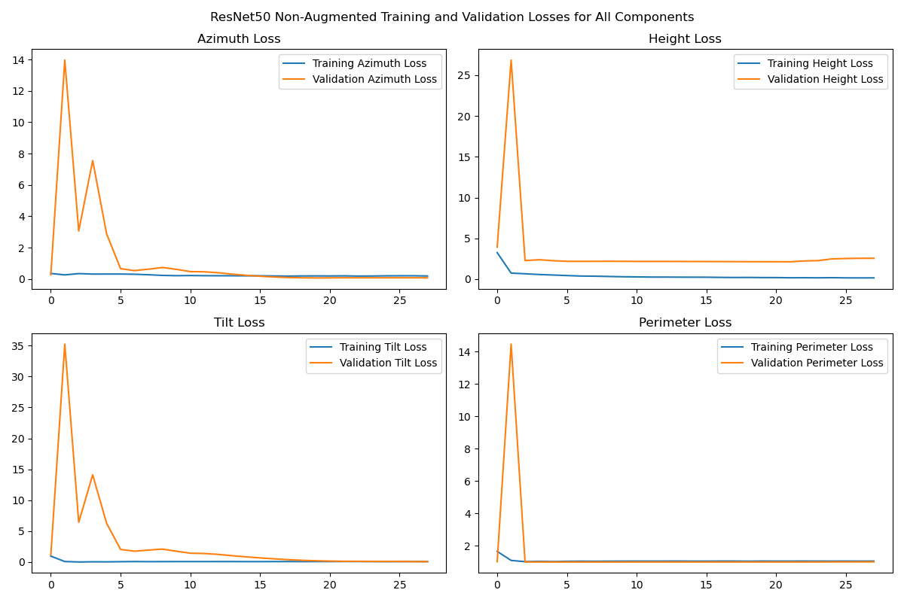
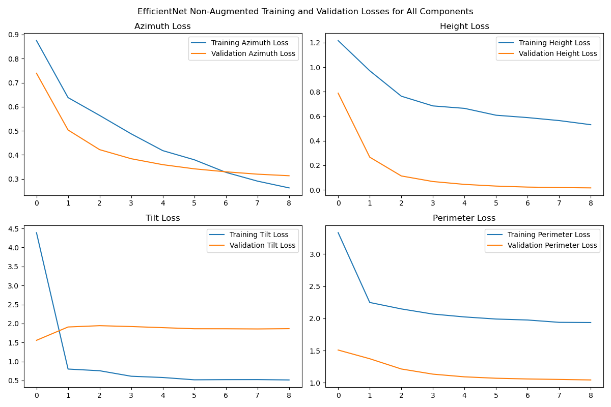
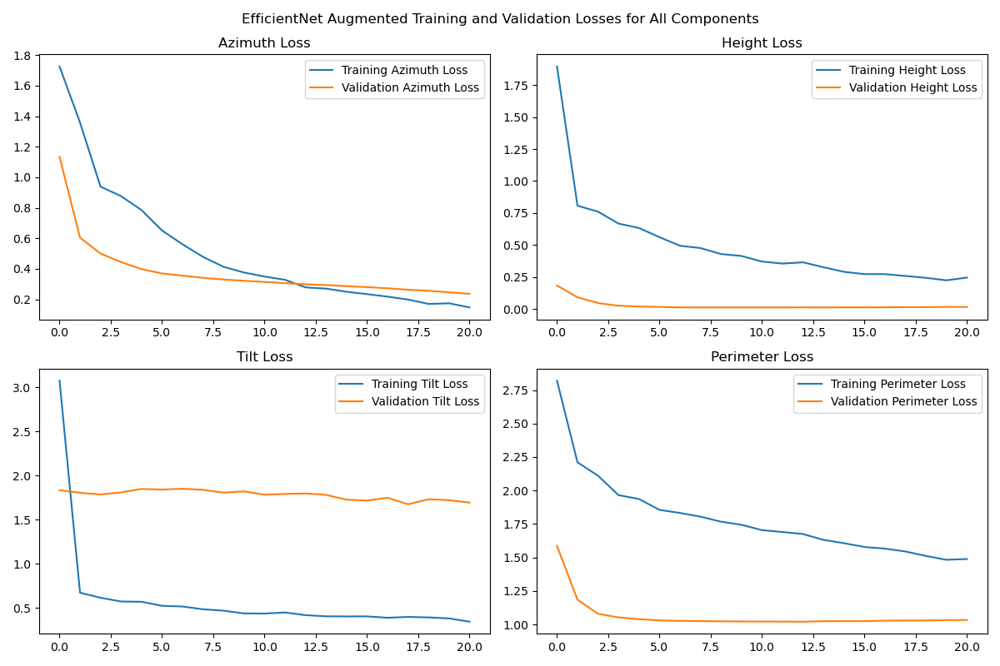

# Roof 3D Reconstruction Model Application

This application leverages deep learning models to predict azimuth, tilt, height, and perimeter of planes from a roof using aerial images and point cloud data. The application supports models based on EfficientNet and ResNet50, as well as additional functionality such as data augmentation, early stopping, and loss visualization.

## Overview

The goal of this application is to use commercial roof point cloud and aerial images to determine height, azimuth, tilt, and perimeters for the planes in the point cloud. The application is multi-task in nature, where each plane parameter (azimuth, tilt, height, and perimeter) is predicted through dedicated output layers.

The key functionalities provided by this application include:
- EfficientNet and ResNet50 model implementations for roof reconstruction tasks.
- Augmentation capabilities for training data.
- Custom loss weights for multi-task learning.
- Visualizations of training and validation loss curves for each output (azimuth, tilt, height, perimeter).
- Early stopping and learning rate reduction based on validation loss.

## Key Components

1. **Models**: 
    - **EfficientNet-based model**: A CNN backbone EfficientNetB0 for feature extraction from aerial images, concatenated with point cloud data to predict azimuth, tilt, height, and perimeter.
    - **ResNet50-based model**: A CNN backbone ResNet50 used similarly for predicting azimuth, tilt, height, and perimeter.

2. **Preprocessing**:
    - Preprocesses aerial images using standard pre-trained network normalization (e.g., ResNet50 or EfficientNet normalization).
    - Point cloud data is standardized and normalized for consistent input to the model.

3. **Training and Callbacks**:
    - The model includes training callbacks such as `EarlyStopping` and `ReduceLROnPlateau` to prevent overfitting and dynamically adjust the learning rate.
    - Supports model evaluation through non-augmented and augmented data.
    
4. **Loss Function**:
    - Uses custom loss weights for multi-task learning to balance the loss across azimuth, tilt, height, and perimeter predictions.

## Dependencies

- Python 3.x
- TensorFlow 2.x
- Keras
- Seaborn
- Pandas
- Matplotlib
- Sklearn
- NumPy

## Installation

1. Clone this repository.
   ```
   git clone <repository_url>
   ```

2. Navigate to the project directory:
   ```
   cd roof_reconstruction_model
   ```

3. Install the required packages:
   ```
   pip install -r requirements.txt
   ```

## Usage

1. **Training the Model**:
   To train the model, use the `roof_cnn.py` script with the following options:
   ```
   python roof_cnn.py --root_dir /path/to/dataset --efficient --augment --subset_size 1000
   ```
   Options:
   - `--root_dir`: The directory containing subdirectories with `google.jpg`, `dsm.json`, and `planes.json` files.
   - `--efficient`: Run the EfficientNet model.
   - `--both`: Run both ResNet50 and EfficientNet models.
   - `--augment`: Enable data augmentation for training.
   - `--subset_size`: Limit the number of directories processed.

2. **Visualizations**:
   The application automatically generates training and validation loss plots for each task. The plots include separate loss curves for:
   - Azimuth
   - Tilt
   - Height
   - Perimeter

## Example

```bash
python roof_cnn.py --root_dir /data/roofs --efficient --augment
```

This command will run the EfficientNet model on the provided dataset, applying data augmentation during training.








